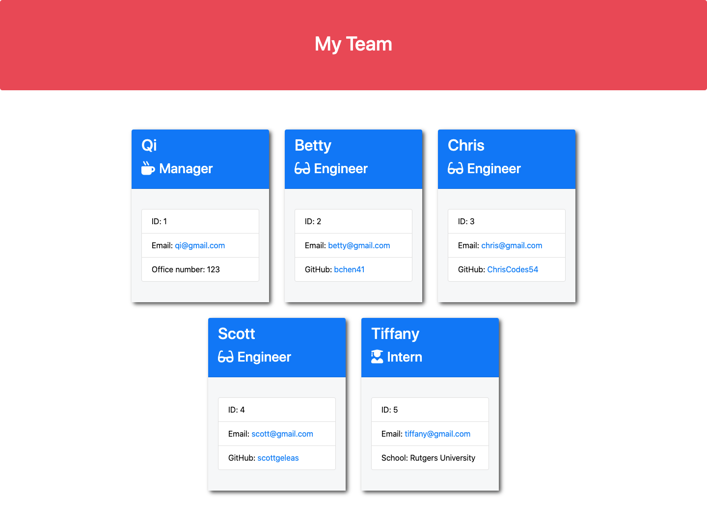

# Team-Profile-Generator

## Description

This project uses Node.js to prompt managers with questions. The inputs will be used to generate a webpage displaying their team's basic information for quick access to the team's emails and GitHub profiles. Futhermore, this project uses Jest to run unit tests.

## Table of Contents

- [Installations](#installations)
- [Usage](#usage)
- [Contributing](#contributing)
- [Questions](#questions)

## Installations

npm init -y

npm install inquirer

npm install jest

## Usage

In the correct folder of your project, open the terminal and run the command, node index.js, and answer the prompted questions.

In order to run the unit tests, open the terminal and run the command, npm test.

### Screenshots of Project

### Video Link of Project

Click [here](https://drive.google.com/file/d/1P-LP1paNrUbHbcPI7UU-kYRW5T_AEvyG/view)!

## Contributing

All are welcomed to contribute as long as the standard industry guidelines are being followed.
Click [here](https://www.contributor-covenant.org/) for industry standard guidelines.

## Questions

For additional questions, contact me by reaching me at my [email](mailto:bettychen41@outlook.com).

You can find my other projects at my [GitHub](https://github.com/bchen41) profile.

Author: Betty Chen
